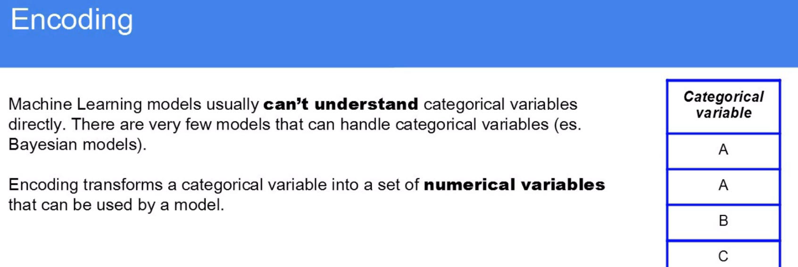

# What is encoding in data pre-processing

It's classified into 
- One hot encoding

What it does:
Converts each categorical value into a binary column (0 or 1).

Creates new columns for each unique category.

Suitable for nominal data (categories without an inherent order).

- Ordinary encoding

What it does:
Assigns integer values to categories based on order.

Suitable for ordinal data (categories with a meaningful ranking).

- Label encoding

What it does:
Similar to Ordinal Encoding but only for a single column (target variable y).

Converts categories into integers arbitrarily (no order implied).