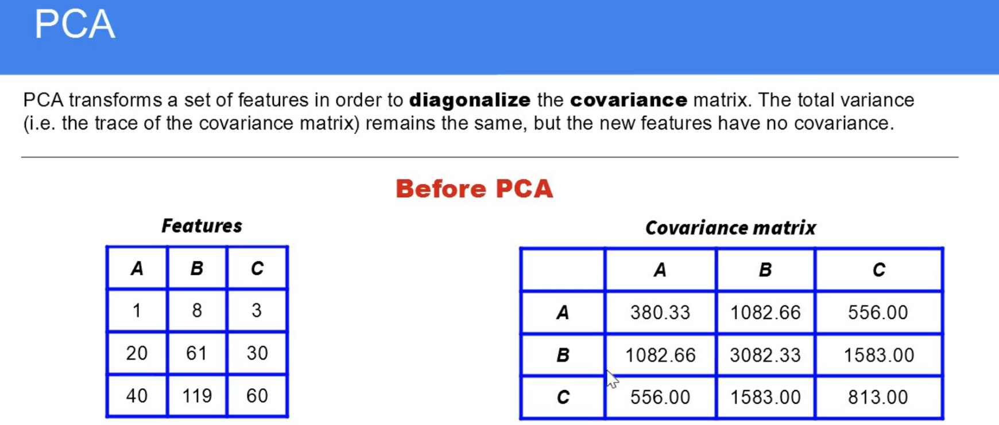
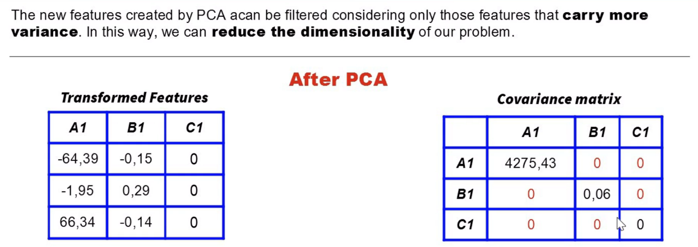

# What PCA Does
- Standardizes the Data (if features are on different scales).

- Computes Covariance Matrix: Measures how features vary together.

- Calculates Eigenvectors & Eigenvalues:

  Eigenvectors = Principal components (directions of maximum variance).

  Eigenvalues = Amount of variance explained by each PC.

- Projects Data onto New Axes: Transforms data into a space defined by the top *k* PCs.

1. Covariance Matrix in PCA
The covariance matrix (C) is central to PCA. It captures how features in the dataset vary together:

C=1/n (X^T.X)

where:
X is the standardized data (mean-centered, and optionally scaled to unit variance).
Each entry 
C_ij quantifies the covariance between features i and j.

2. Diagonalization of the Covariance Matrix
PCA diagonalizes C to find its eigenvectors (principal components) and eigenvalues (variances):

C =V Λ V^T
 
where:

V: Matrix of eigenvectors (each column is a PC, orthogonal and unit-length).

Λ: Diagonal matrix of eigenvalues (
(λ_1 ≥ λ_2 ≥ ⋯ ≥ λ_p)

Why Diagonalize?

Diagonalization transforms  C into a coordinate system where features are uncorrelated (PCs).

Eigenvectors define the directions of maximum variance.

Eigenvalues quantify the variance along each PC.

3. Trace of the Covariance Matrix
The trace (sum of diagonal elements) of C is the total variance in the data:

 
Interpretation:

The total variance is preserved after PCA but redistributed to the PCs.

The proportion of variance explained by the 
k-th PC is:

λ_k= Tr(C)

​
 
​
 
