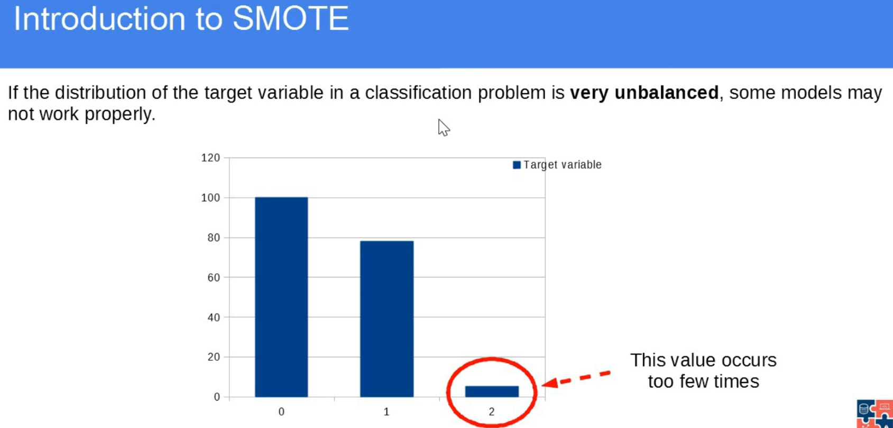
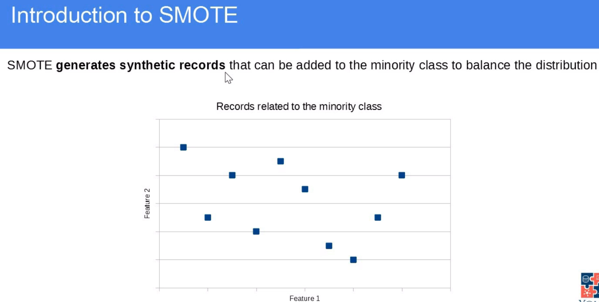
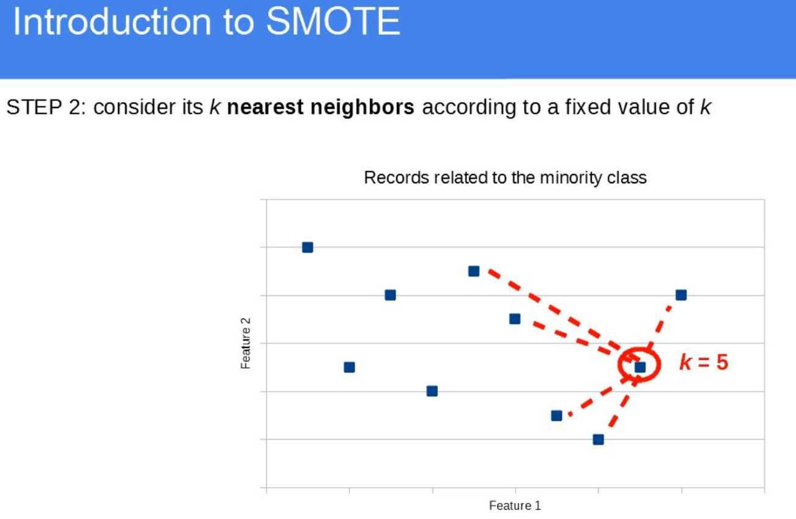
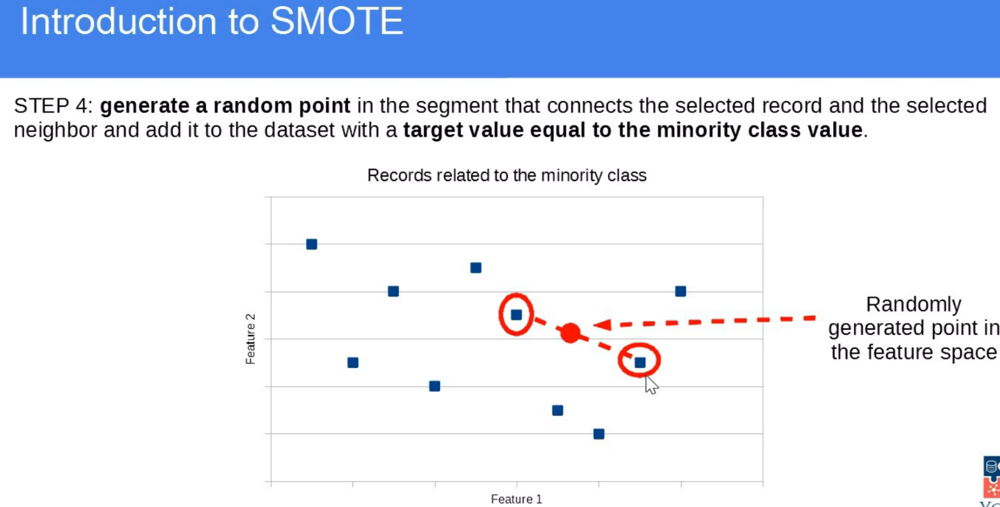
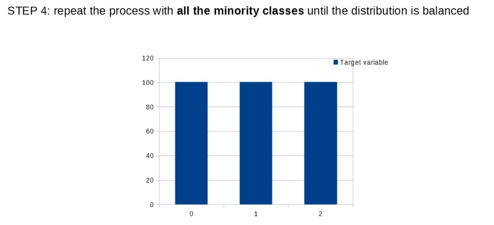

# SMOTE (Synthetic Minority Over-sampling Technique) 

It's is a popular method for handling class imbalance in machine learning datasets. It generates synthetic samples for the minority class to balance the class distribution, improving model performance on underrepresented classes.

## Why Use SMOTE?
- In imbalanced datasets (e.g., fraud detection, rare disease prediction), traditional ML models tend to favor the majority class. SMOTE helps by:

- Balancing class distribution (oversampling the minority class).

- Reducing overfitting compared to random oversampling.

- Improving model recall & precision for minority classes.