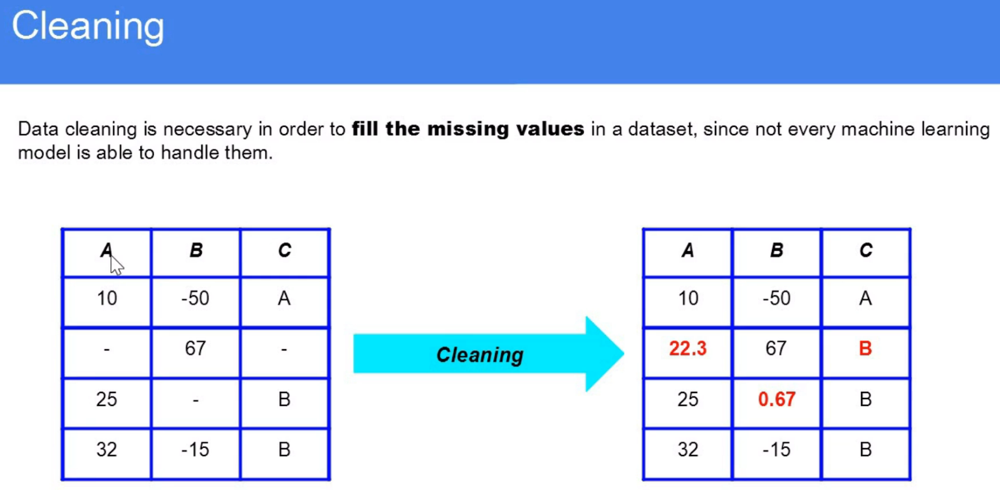
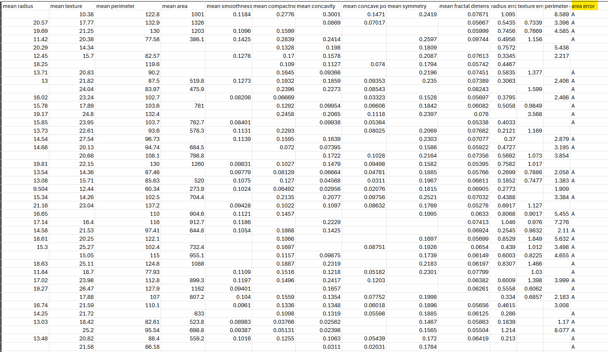
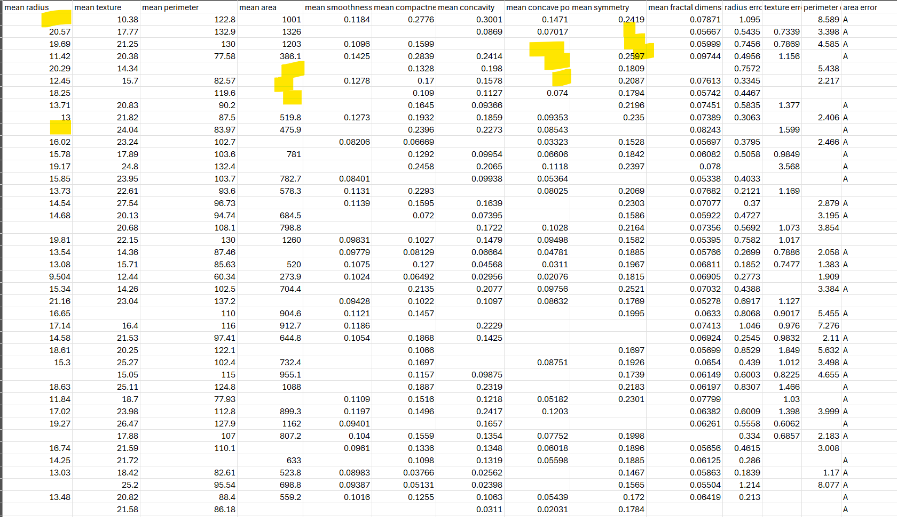
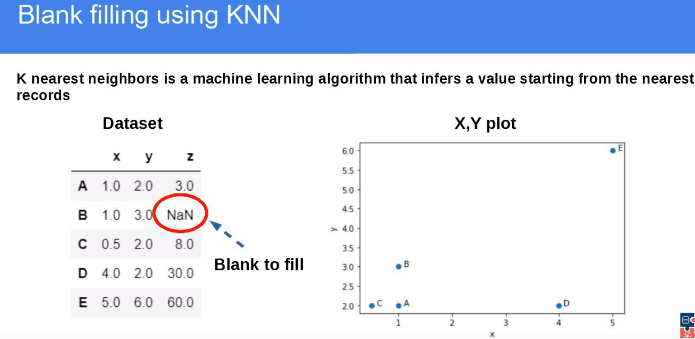
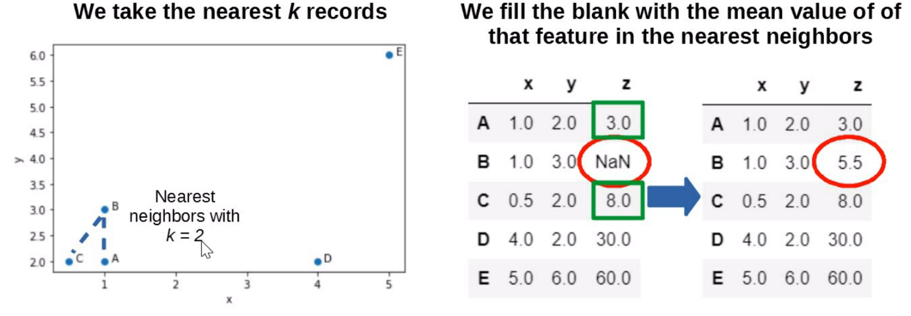

What is data cleaning?

Steps to follow:

1. Find which column are numerical and which ones are categorical

Here area error is a categorical column

Others  seem to be numerical data. Except that, there are so many data missing

In the ipynb, it is presented as NaN (Not a Number)

For numerical values, we can put the column's meaan/median/fixed value there. For categorical values, we can put most frequent value/fixed categorical value there.

# Other ways
1. KNN
Filling the gap  with KNN (K nearest Neighbours) value

Here for the missing value of B, we are checking A and C as K=2 meaning, we need to look for 2 neighbours

Then we got 3 and 8 as their value and average that to get 5.5

2. ColumnTransformer

Using ColumnTransformer, now you can use KNNI or others. It's mostly used.

Now practice, using practice.ipynb and check solution (practice_solution.ipynb) if needed